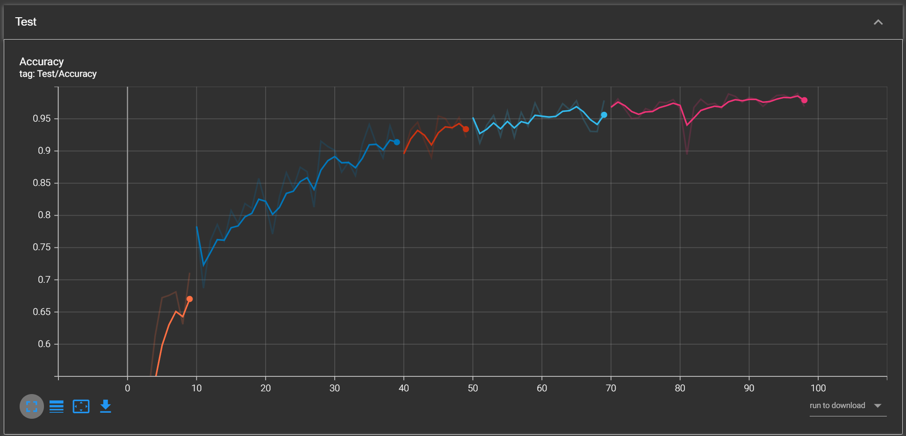
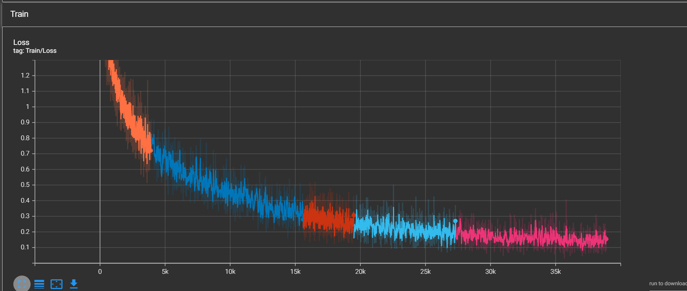
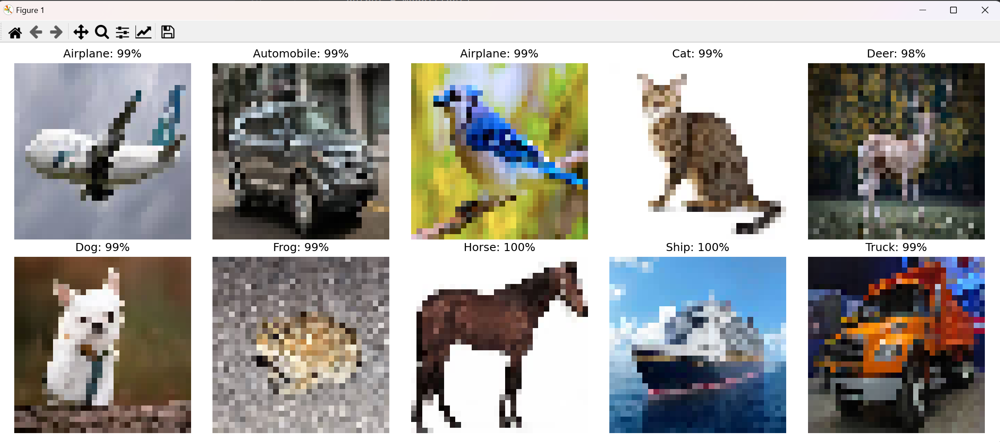

# 🧠 ResNet-like CIFAR-10 Classifier

A simple yet effective computer vision project built from scratch.  
We train a custom ResNet-style neural network on the CIFAR-10 dataset using **PyTorch**.  
The project includes training logs via **TensorBoard** and example predictions with test images.

---

## 📦 Features

- ✅ Custom deep CNN inspired by ResNet architecture  
- ✅ Trained on the popular **CIFAR-10** dataset  
- ✅ Integrated with **TensorBoard** for real-time monitoring  
- ✅ Visualized sample predictions after training  
- ✅ Clean training/evaluation pipeline using `argparse`

---

## 🔧 Requirements

Make sure you have **Python 3.7+** installed.

### 📚 Install dependencies
```bash
pip install torch torchvision scikit-learn tqdm matplotlib
```

---

## 🚀 Run the Project

### 🏋️‍♂️ Train the Model
```bash
python train_model.py --epochs 50 --batch_size 8
```

### 🔎 Evaluate on Test Set
```bash
python main.py --mode test --weights check_point/best_model_f.pt
```

---

## 📊 TensorBoard Logs

After training, launch TensorBoard:
```bash
tensorboard --logdir tensorboard
```

Then open [http://localhost:6006](http://localhost:6006) to explore training metrics like loss, accuracy, etc.

---

## 📈 Training Curves

### ✅ Accuracy over Epochs
<p align="center">
  
</p>

### ❌ Loss over Epochs
<p align="center">
  
</p>

---

## 🖼️ Sample Predictions

Here are a few sample predictions made by the trained model:

<p align="center">
  
</p>

---
